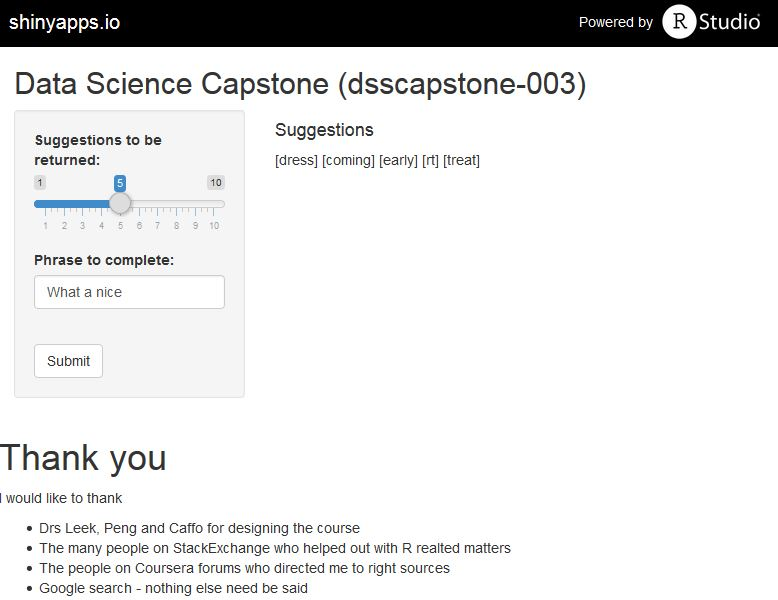

JHU Data Science Capstone (dsscapstone-003)
========================================================
transition: rotate
author: Alan C. Bonnici
date: March 2015

    </img>

Prediction Application
========================================================

JHU Data Science Capstone (dsscapstone-003)

***
The application stored at https://chribonn.shinyapps.io/dsscapstone-003/ allows a person to type a phrase and have a number of suggestions returned. The user can control the number of words that the application suggests.

Behind the App
========================================================

JHU Data Science Capstone (dsscapstone-003)

<small>
When the user hits the submit button in the string is loaded into the prediction engine:

1. Prepare the string (change to lower case and expand contractions (*Jones isn't going* becomes *Jones is not going*)
2. If the string is longer than 7 words reduce it to 7
3. Using a matrix-based dictionary to find a list of possible words that could apply. For each word compute a score
4. If at least 1 result is returned find the top *n* words (as indicated by the user) and return the answer.
5. If no word can be found, remove one word from the sentence and repeat step 4 until either a result is generated or no suggestion can be generated.
</small>

The Dictionary
========================================================

JHU Data Science Capstone (dsscapstone-003)

<small>
The dictionary is built on data from a corpus called **HC Corpora**. [Click here to download](https://d396qusza40orc.cloudfront.net/dsscapstone/dataset/Coursera-SwiftKey.zip). The English language data consisted of blog, news and twitter text. Initial text exploration of the source can be found by vising the [Online Text Eploration Report](http://rpubs.com/chribonn/MilestoneReport).

Computer processing resources, time, application response time and limitations at shinyapps.io were all factors that dictated how large the final dictionary could be. After *many* trials the optimal size was determined to be a dictionary based on a random sample 3000 sentences (1000 from each source) processed into 8 tokens. 
</small>

Final Observations
========================================================

JHU Data Science Capstone (dsscapstone-003)

This solution is a statistical one rather than rule based. Rather than attempt to build a complex rule-based engine in which one attempts to define mechanistically what should come next, the solution analysed existing conversations and from just 3000 sentences attempts an Auto-prediction function.

Information on this approach can be found in the section **NLP using machine learning** in [Wikipedia ](http://en.wikipedia.org/wiki/Natural_language_processing).

The promise behind such a model is that given a population-representative database written in any language the prediction algorithm should be able to predict in that language.
